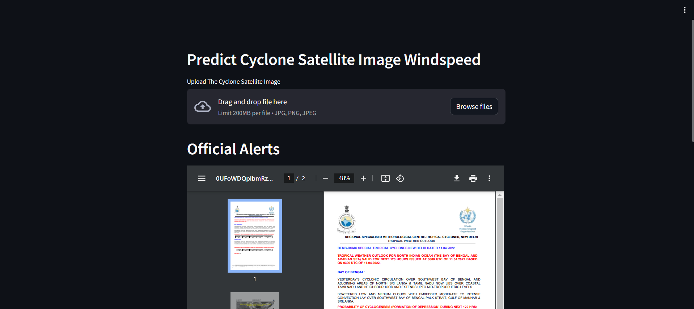
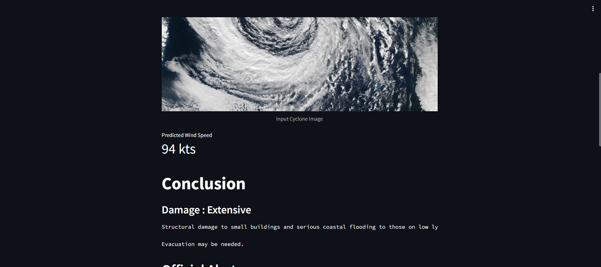

## Cyclone Intensity Estimation using Deep Learning


This application provides a user-friendly interface for uploading INSAT-3D IR Satellite Images of cyclones. These images are then processed by a state-of-the-art Deep Convolutional Neural Network (CNN) built using TensorFlow.

Our CNN model has been meticulously trained on a diverse dataset of cyclone imagery, comprising raw INSAT-3D satellite images, to accurately estimate cyclone intensity. This eliminates the need for traditional methods, ensuring precise center determination and intensity estimation directly from satellite imagery.

**Key Features:**

1. **Image Upload**: Users can easily upload INSAT-3D IR Satellite Images of cyclones directly through the intuitive interface.

2. **CNN Processing**: The uploaded images are seamlessly passed through our deep CNN model, leveraging cutting-edge TensorFlow technology.

3. **Instant Results**: Within moments, users receive real-time estimations of cyclone intensity in knots, providing swift and accurate insights.

**Benefits:**

- **Accuracy**: Our CNN model delivers highly precise estimations of cyclone intensity, surpassing traditional methods.

- **Efficiency**: By automating the intensity estimation process, users save time and resources, enabling rapid decision-making.

- **Accessibility**: The user-friendly interface makes it accessible to both experts and non-experts in cyclone tracking and analysis.

**Get Started**: Experience the power of AI-driven cyclone intensity estimation by uploading your INSAT-3D IR Satellite Images now!


## The Streamlit app is hosted on  Streamlit community cloud.

``Streamlit Link:`` [Link](https://awanishyadav967-cyclonespeed-prediction-main-ph86ib.streamlit.app/)

## Dataset

[Curated Dataset link](https://www.kaggle.com/datasets/sshubam/insat3d-infrared-raw-cyclone-images-20132021)

##Jupyter Code

[Google drive link](https://drive.google.com/file/d/1dm3Q_mTmZrdhOI6y-fOWfFCJU3n2jOKx/view?usp=sharing).

## Tech Stack Used

Tools : Tensorflow-keras,python,Streamlit


## Screenshots

# 1 

# 2 

## Getting Started

To run the Cyclone Intensity Detector locally, follow these steps:

1. Clone the repository:

    ```bash
    git clone https://github.com/awanishyadav967/Cyclone-detector.git
    ```

2. Install the necessary dependencies:

    ```bash
    pip install -r requirements.txt
    ```

3. Run the application:

    ```bash
    streamlit run app.py
    ```


## Feedback

If you have any feedback or suggestions, feel free to [open an issue](https://github.com/awanishyadav967/Cyclone-detector/issues) or [submit a pull request](https://github.com/awanishyadav967/Cyclone-detector/pulls).


# Note 
App may went to sleep mode ,click-"Yes,get this app back" (it will take few second to open)
