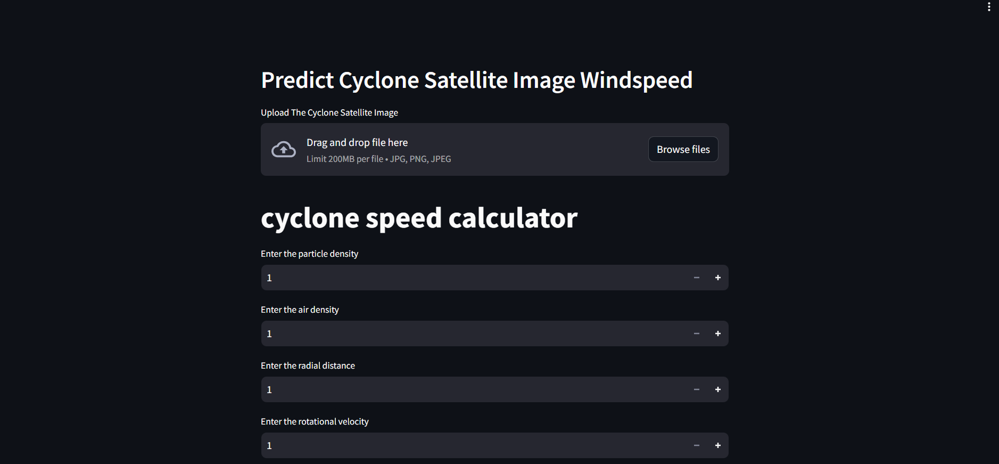

# Cyclone Intensity Detector

This project is a Cyclone Intensity Detector developed using imagery from INSAT-3D, an ISRO satellite. The detector utilizes deep learning techniques to analyze satellite images and predict the intensity of cyclones.

## Overview

The Cyclone Intensity Detector leverages machine learning models trained on INSAT-3D satellite imagery to assess the severity of cyclones. By analyzing various features and patterns in the satellite images, the detector provides valuable insights into the intensity of cyclones, aiding in disaster management and preparedness efforts.

## Features

- **Deep Learning Models**: Utilizes state-of-the-art deep learning models for image analysis.
- **Real-time Prediction**: Provides real-time predictions of cyclone intensity based on satellite imagery.
- **User-Friendly Interface**: Offers an intuitive interface for users to upload satellite images and receive intensity predictions.

## Screenshots



## Getting Started

To run the Cyclone Intensity Detector locally, follow these steps:

1. Clone the repository:

    ```bash
    git clone https://github.com/awanishyadav967/Cyclone-detector.git
    ```

2. Install the necessary dependencies:

    ```bash
    pip install -r requirements.txt
    ```

3. Run the application:

    ```bash
    streamlit run app.py
    ```

## Feedback

If you have any feedback or suggestions, feel free to [open an issue](https://github.com/awanishyadav967/Cyclone-detector/issues) or [submit a pull request](https://github.com/awanishyadav967/Cyclone-detector/pulls).

